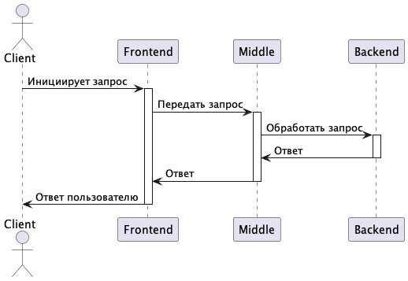
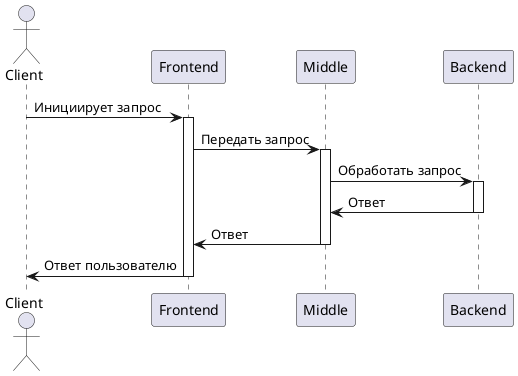

# Мини-Банк
Проект "Мини-Банк" разрабатывается в рамках бэкенд-академии [GPB IT FACTORY 2024](https://gpb.fut.ru/itfactory/backend). Проект включает в себя создание системы, состоящей из трёх компонентов: frontend (Telegram-бот), middle-слоя и backend.

## Архитектура системы

<details>
  <summary>Посмотреть код PlantUML</summary>


</details>

### Компоненты системы
1. **Frontend (Telegram-бот)**
   - Выступает как клиентское приложение.
   - Инициирует запросы пользователей.

2. **Middle-слой (Java/Kotlin-сервис)**
   - Принимает запросы от Telegram-бота.
   - Выполняет валидацию и маршрутизацию запросов.

3. **Backend (Java/Kotlin-сервис)**
   - Обрабатывает банковские транзакции.
   - Хранит клиентские данные.

## Доступные операции

1. /register - регистрация в приложении банка;
2. /createaccount - открытие счёта; 
3. /currentbalance - проверка баланса; 
4. /transfer [пользователь] [сумма] - перевод средств.

## Стек технологий

### Платформы
- **Java Spring Boot** версия 3.3.0
- **Gradle** версия 8.7
- **JDK** версия 21.0.3

### Интерфейс
- java-telegram-bot-api
### База данных
- PostgreSQL

## Запуск проекта
Linux/MacOS:

1. Клонирование репозитория:
```
$ git clone https://github.com/gpb-it-factory/protasov-telegram-bot.git
$ cd protasov-telegram-bot
```

<details>
  <summary>Запуск через Docker</summary>

2. Сборка Docker образа:

```
$ docker build -t minibank .
``` 
3. Запуск контейнера:
```
docker run -d --name run-minibank -e bot_token="твой_bot_token" minibank
```
</details>

<details>
  <summary>Запуск через Gradle</summary>

2. Настройка параметров бота:

```
$ export bot_token="твой_bot_token"
```
3. Запуск приложения:

```
$ ./gradlew bootRun
```
</details>


## Материалы и ресурсы
- [Практические задания](https://github.com/gpb-it-factory/practice/tree/trunk/exercises)
