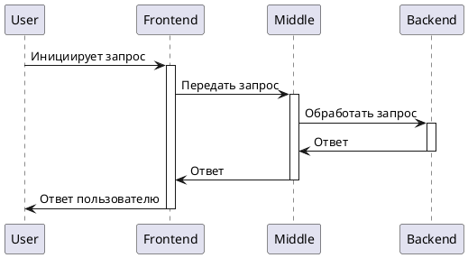

# Мини-Банк
Проект "Мини-Банк" разрабатывается в рамках бэкенд-академии [GPB IT FACTORY 2024](https://gpb.fut.ru/itfactory/backend). Проект включает в себя создание системы, состоящей из трёх компонентов: frontend (Telegram-бот), middle-слоя и backend.

## Архитектура системы

  
Посмотреть код PlantUML

### Компоненты системы
1. **Frontend (Telegram-бот)**
   - Выступает как клиентское приложение.
   - Инициирует запросы пользователей.

2. **Middle-слой (Java/Kotlin-сервис)**
   - Принимает запросы от Telegram-бота.
   - Выполняет валидацию и маршрутизацию запросов.

3. **Backend (Java/Kotlin-сервис)**
   - Обрабатывает банковские транзакции.
   - Хранит клиентские данные.

## Используемые технологии и инструменты

### Платформы и фреймворки
- Java Spring Boot
- Gradle

### Интерфейс и взаимодействие
- java-telegram-bot-api
### База данных
- PostgreSQL

## Начало работы

Чтобы начать работу с проектом, клонируйте репозиторий и следуйте инструкциям.

## Материалы и ресурсы
- [Практические задания](https://github.com/gpb-it-factory/practice/tree/trunk/exercises)
